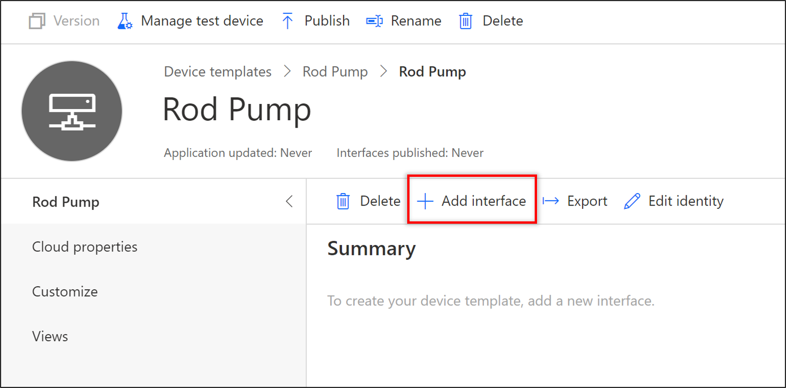
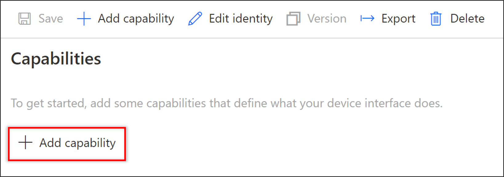
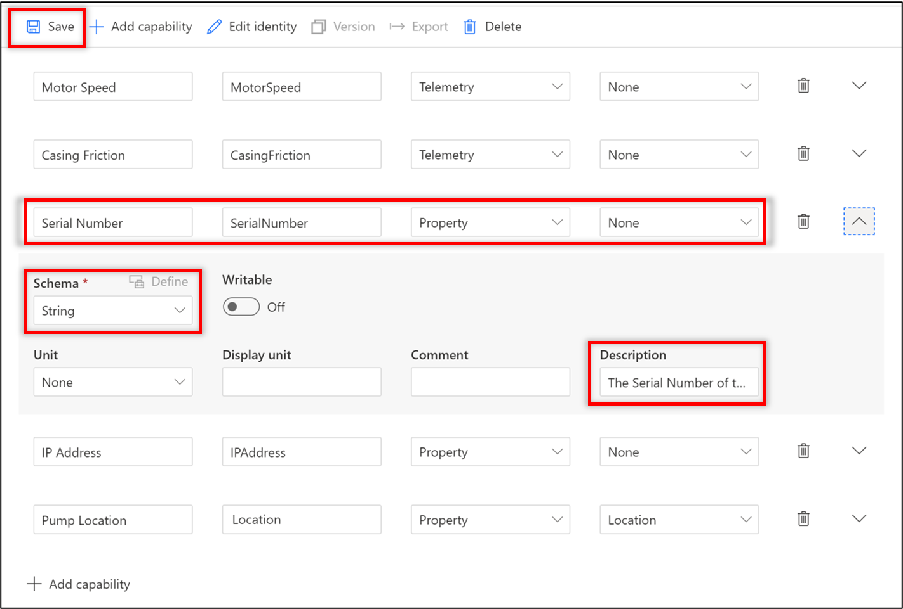
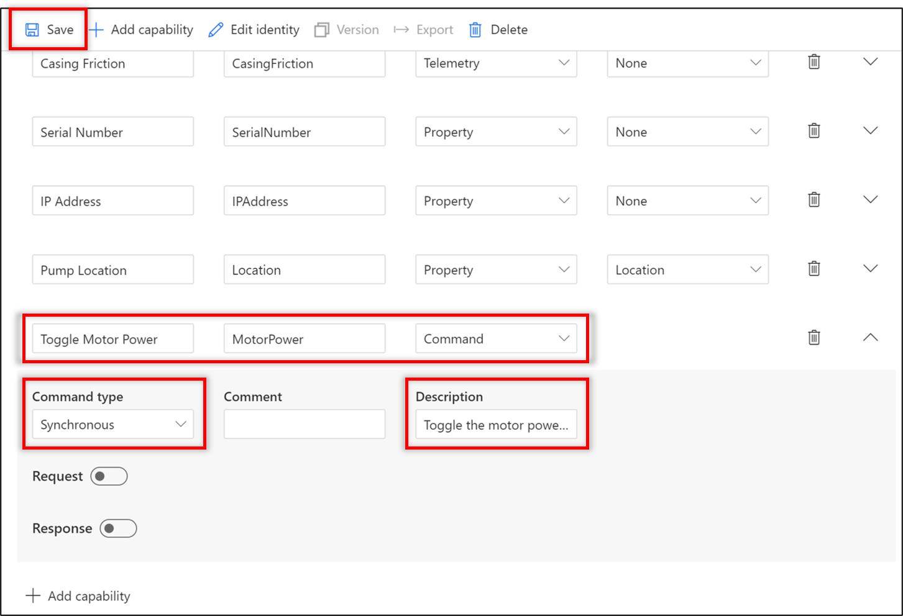
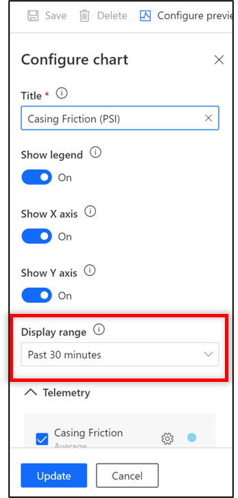
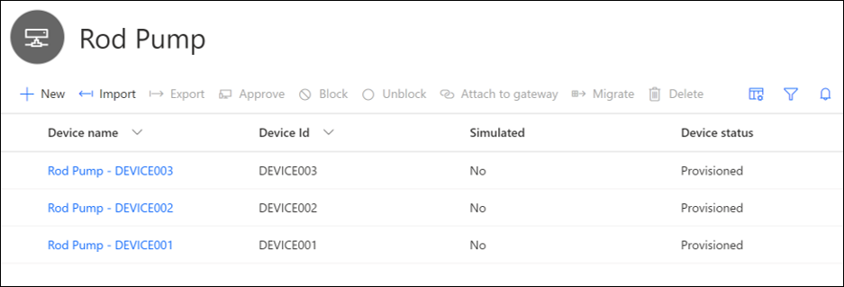
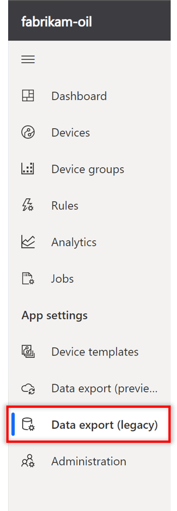
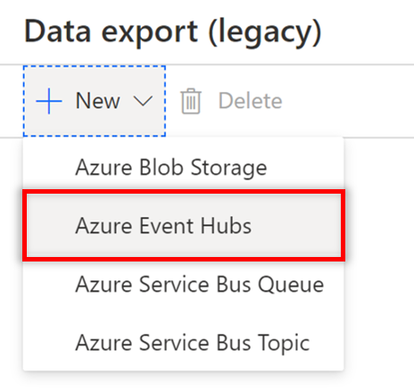
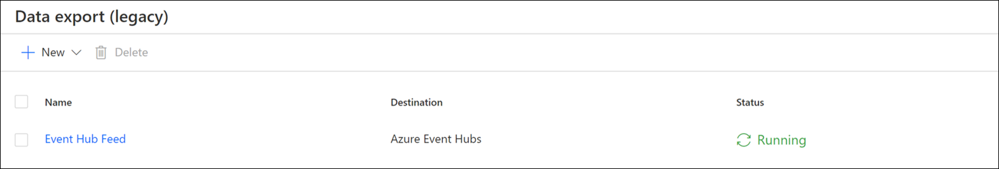

<div class="MCWHeader1">
Predictive Maintenance for remote field devices
</div>

<div class="MCWHeader2">
Hands-on lab step-by-step
</div>

<div class="MCWHeader3">
May 2020
</div>

Information in this document, including URL and other Internet Web site references, is subject to change without notice. Unless otherwise noted, the example companies, organizations, products, domain names, e-mail addresses, logos, people, places, and events depicted herein are fictitious, and no association with any real company, organization, product, domain name, e-mail address, logo, person, place or event is intended or should be inferred. Complying with all applicable copyright laws is the responsibility of the user. Without limiting the rights under copyright, no part of this document may be reproduced, stored in or introduced into a retrieval system, or transmitted in any form or by any means (electronic, mechanical, photocopying, recording, or otherwise), or for any purpose, without the express written permission of Microsoft Corporation.

Microsoft may have patents, patent applications, trademarks, copyrights, or other intellectual property rights covering subject matter in this document. Except as expressly provided in any written license agreement from Microsoft, the furnishing of this document does not give you any license to these patents, trademarks, copyrights, or other intellectual property.

The names of manufacturers, products, or URLs are provided for informational purposes only and Microsoft makes no representations and warranties, either expressed, implied, or statutory, regarding these manufacturers or the use of the products with any Microsoft technologies. The inclusion of a manufacturer or product does not imply endorsement of Microsoft of the manufacturer or product. Links may be provided to third party sites. Such sites are not under the control of Microsoft and Microsoft is not responsible for the contents of any linked site or any link contained in a linked site, or any changes or updates to such sites. Microsoft is not responsible for webcasting or any other form of transmission received from any linked site. Microsoft is providing these links to you only as a convenience, and the inclusion of any link does not imply endorsement of Microsoft of the site or the products contained therein.

© 2020 Microsoft Corporation. All rights reserved.

Microsoft and the trademarks listed at <https://www.microsoft.com/en-us/legal/intellectualproperty/Trademarks/Usage/General.aspx> are trademarks of the Microsoft group of companies. All other trademarks are property of their respective owners.

**Contents**

<!-- TOC -->

- [Predictive Maintenance for remote field devices hands-on lab step-by-step](#predictive-maintenance-for-remote-field-devices-hands-on-lab-step-by-step)
  - [Abstract and learning objectives](#abstract-and-learning-objectives)
  - [Overview](#overview)
  - [Solution architecture](#solution-architecture)
  - [Requirements](#requirements)
  - [Before the hands-on lab](#before-the-hands-on-lab)
  - [Exercise 1: Configuring IoT Central with devices and metadata](#exercise-1-configuring-iot-central-with-devices-and-metadata)
    - [Task 1: Model the telemetry data](#task-1-model-the-telemetry-data)
      - [Telemetry schema](#telemetry-schema)
    - [Task 2: Create an IoT Central application](#task-2-create-an-iot-central-application)
    - [Task 3: Create the Device Template](#task-3-create-the-device-template)
    - [Task 4: Create and provision real devices](#task-4-create-and-provision-real-devices)
    - [Task 5: Delete the simulated device](#task-5-delete-the-simulated-device)
  - [Exercise 2: Run the Rod Pump Simulator](#exercise-2-run-the-rod-pump-simulator)
    - [Task 1: Generate device connection strings](#task-1-generate-device-connection-strings)
    - [Task 2: Open the Visual Studio solution, and update connection string values](#task-2-open-the-visual-studio-solution-and-update-connection-string-values)
    - [Task 3: Run the application](#task-3-run-the-application)
    - [Task 4: Interpret telemetry data](#task-4-interpret-telemetry-data)
    - [Task 5: Restart a failing pump remotely](#task-5-restart-a-failing-pump-remotely)
  - [Exercise 3: Create an Event Hub and continuously export data from IoT Central](#exercise-3-create-an-event-hub-and-continuously-export-data-from-iot-central)
    - [Task 1: Create an Event Hub](#task-1-create-an-event-hub)
    - [Task 2: Configure continuous data export from IoT Central](#task-2-configure-continuous-data-export-from-iot-central)
  - [Exercise 4: Use Azure Databricks and Azure Machine Learning service to train and deploy predictive model](#exercise-4-use-azure-databricks-and-azure-machine-learning-service-to-train-and-deploy-predictive-model)
    - [Task 1: Run the Anomaly Detection notebook](#task-1-run-the-anomaly-detection-notebook)
  - [Exercise 5: Create an Azure Function to predict pump failure](#exercise-5-create-an-azure-function-to-predict-pump-failure)
    - [Task 1: Create an Azure Function Application](#task-1-create-an-azure-function-application)
    - [Task 2: Create a notification table in Azure Storage](#task-2-create-a-notification-table-in-azure-storage)
    - [Task 3: Create a notification queue in Azure Storage](#task-3-create-a-notification-queue-in-azure-storage)
    - [Task 4: Create notification service in Logic Apps](#task-4-create-notification-service-in-logic-apps)
    - [Task 5: Obtain connection settings for use with the Azure Function implementation](#task-5-obtain-connection-settings-for-use-with-the-azure-function-implementation)
    - [Task 6: Create the local settings file for the Azure Functions project](#task-6-create-the-local-settings-file-for-the-azure-functions-project)
    - [Task 7: Review the Azure Function code](#task-7-review-the-azure-function-code)
    - [Task 8: Run the Function App locally](#task-8-run-the-function-app-locally)
    - [Task 9: Prepare the Azure Function App with settings](#task-9-prepare-the-azure-function-app-with-settings)
    - [Task 10: Deploy the Function App into Azure](#task-10-deploy-the-function-app-into-azure)
  - [After the hands-on lab](#after-the-hands-on-lab)
    - [Task 1: Delete Lab Resources](#task-1-delete-lab-resources)

<!-- /TOC -->

# Predictive Maintenance for remote field devices hands-on lab step-by-step

## Abstract and learning objectives

In this hands-on-lab, you will build an end-to-end industrial IoT solution. We will begin by leveraging the Azure IoT Central SaaS offerings to quickly stand up a fully functional remote monitoring solution. Azure IoT Central provides solutions built upon recommendations found in the [Azure IoT Reference Architecture](https://docs.microsoft.com/en-us/azure/architecture/reference-architectures/iot/). We will customize this system specifically for rod pumps. Rod pumps are industrial equipment that is heavily used in the oil and gas industry. We will then establish a model for the telemetry data that is received from the pump systems in the field and use this model to deploy simulated devices for system testing purposes.

Furthermore, we will establish threshold rules in the remote monitoring system that will monitor the incoming telemetry data to ensure all equipment is running optimally, and can alert us whenever the equipment is running outside of normal boundaries - indicating the need for alternative running parameters, maintenance, or a complete shutdown of the pump. By leveraging the IoT Central solution, users can also issue commands to the pumps from a remote location in an instant to automate many operational and maintenance tasks which used to require staff on-site. This lessens operating costs associated with technician dispatch and equipment damage due to a failure.

Above and beyond real-time monitoring and mitigating immediate equipment damage through commanding - you will also learn how to apply the historical telemetry data accumulated to identify positive and negative trends that can be used to adjust daily operations for higher throughput and reliability.

## Overview

The Predictive Maintenance for Remote Field Devices hands-on lab is an exercise that will challenge you to implement an end-to-end scenario using the supplied example that is based on Azure IoT Central and other related Azure services. The hands-on lab can be implemented on your own, but it is highly recommended to pair up with other members at the lab to model a real-world experience and to allow each member to share their expertise for the overall solution.

## Solution architecture


[Azure IoT Central](https://docs.microsoft.com/azure/iot-central/overview-iot-central) is at the core of the preferred solution. It is used for data ingest, device management, data storage, and reporting. IoT field devices securely connect to IoT Central through its cloud gateway. The continuous export component sends device telemetry data to [Azure Blob storage](https://docs.microsoft.com/azure/storage/blobs/storage-blobs-overview) for cold storage, and the same data to [Azure Event Hubs](https://docs.microsoft.com/azure/event-hubs/event-hubs-about) for real-time processing. Azure Databricks uses the data stored in cold storage to periodically re-train a Machine Learning (ML) model to detect oil pump failures. It is also used to deploy the trained model to a web service hosted by [Azure Kubernetes Service](https://docs.microsoft.com/azure/aks/) (AKS) or [Azure Container Instances](https://docs.microsoft.com/azure/container-instances/) (ACI), using [Azure Machine Learning](https://docs.microsoft.com/azure/machine-learning/service/overview-what-is-azure-ml). An [Azure function](https://docs.microsoft.com/azure/azure-functions/functions-overview) is triggered by events flowing through Event Hubs. It sends the event data for each pump to the web service hosting the deployed model, then sends an alert through [Azure Logic Apps](https://azure.microsoft.com/en-us/services/logic-apps/) if an alert has not been sent within a configurable period of time. The alert is sent in the form of an email, identifying the failing oil pump with a suggestion to service the device.

_Azure IoT Central architecture_


The diagram above shows the components of IoT Central's architecture that pertain to Fabrikam's use case. Because it is a SaaS-based solution, the Azure services IoT Central uses are hidden from view. IoT field devices securely connect to IoT Central through its cloud gateway. The gateway uses Azure IoT Hub Device Provisioning Service (DPS) to streamline device management, and the underlying IoT Hub service facilitates bi-directional communication between the cloud and IoT devices. All device telemetry is stored in a time series data store, based on Azure Time Series Insights. The application data store persists the IoT Central application and its customizations. This application provides a user interface shell, through which Fabrikam's users manage devices and associated metadata, view dashboards and reports, and configure rules and actions to react to device telemetry that indicates possible rod pump failure. Pervasive throughout the end-to-end solution is security in transit and at rest for devices and the web-based management application. The continuous data export feature is used to enable hot and cold path workloads on real-time and batch device telemetry and metadata, using external services. Batch data is exported to Azure Blob storage in Apache Avro file format each minute, and real-time data is exported to either Azure Event Hubs or Azure Service Bus.

## Requirements

1. Microsoft Azure subscription (non-Microsoft subscription, must be a pay-as-you subscription).
2. [.NET Core SDK 3.1.107](https://dotnet.microsoft.com/download/dotnet-core/3.1)
3. [Visual Studio Code](https://code.visualstudio.com/) version 1.39 or greater
4. [C# Visual Studio Code Extension](https://marketplace.visualstudio.com/items?itemName=ms-vscode.csharp)
5. [Azure Functions Core Tools version 2.x (using NPM or Chocolatey - see readme on GitHub repository)](https://github.com/Azure/azure-functions-core-tools)
6. [Azure Functions Visual Studio Code Extension](https://marketplace.visualstudio.com/items?itemName=ms-azuretools.vscode-azurefunctions)
7. An Azure Databricks cluster running Databricks Runtime 5.1 or above.
8. [Node.JS](https://nodejs.org/dist/v12.18.3/node-v12.18.3-x64.msi)

## Before the hands-on lab

Refer to the [Before the hands-on lab setup guide](./Before%20the%20HOL%20-%20Predictive%20Maintenance%20for%20remote%20field%20devices.md) manual before continuing to the lab exercises.

## Exercise 1: Configuring IoT Central with devices and metadata

Duration: 45 minutes

[Azure IoT Central](https://azure.microsoft.com/en-us/services/iot-central/) is a Software as a Service (SaaS) offering from Microsoft. The aim of this service is to provide a frictionless entry into the Cloud Computing and IoT space. The core focus of many industrial companies is not on cloud computing; therefore, they do not necessarily have the personnel skilled to provide guidance and to stand up a reliable and scalable infrastructure for an IoT solution. It is imperative for these types of companies to enter the IoT space not only for the cost savings associated with remote monitoring, but also to improve safety for their workers and the environment.

Fabrikam is one such company that could use a helping hand entering the IoT space. They have recently invested in sensor technology on their rod pumps in the field, and they are ready to implement their cloud-based IoT Solution. Their IT department is small and unfamiliar with cloud-based IoT infrastructure; their IT budget also does not afford them the luxury of hiring a team of contractors to build out a solution for them.

The Fabrikam CIO has recently heard of Azure IoT Central. This online offering will streamline the process of them getting their sensor data to the cloud, where they can monitor their equipment for failures and improve their maintenance practices and not have to worry about the underlying infrastructure. A [predictable cost model](https://azure.microsoft.com/en-us/pricing/details/iot-central/) also ensures that there are no financial surprises.

### Task 1: Model the telemetry data

The first task is to identify the data that the equipment will be sending to the cloud. This data will contain fields that represent the data read from the sensors at a specific instant in time. This data will be used downstream systems to identify patterns that can lead to cost savings, increased safety and more efficient work processes.

The telemetry being reported by the Fabrikam rod pumps are as follows, we will be using this information later in the lab:

#### Telemetry schema

| Field          | Type     | Description                                                                                                                                                                        |
| -------------- | -------- | ---------------------------------------------------------------------------------------------------------------------------------------------------------------------------------- |
| SerialNumber   | String   | Unique serial number identifying the rod pump equipment                                                                                                                            |
| IPAddress      | String   | Current IP Address                                                                                                                                                                 |
| TimeStamp      | DateTime | Timestamp in UTC identifying the point in time the telemetry was created                                                                                                           |
| PumpRate       | Numeric  | Speed calculated over the time duration between the last two times the crank arm has passed the proximity sensor measured in Strokes Per Minute (SPM) - minimum 0.0, maximum 100.0 |
| TimePumpOn     | Numeric  | Number of minutes the pump has been on                                                                                                                                             |
| MotorPowerkW   | Numeric  | Measured in Kilowatts (kW)                                                                                                                                                         |
| MotorSpeed     | Numeric  | including slip (RPM)                                                                                                                                                               |
| CasingFriction | Numeric  | Measured in PSI (psi)                                                                                                                                                              |

### Task 2: Create an IoT Central application

1. Access the [Azure IoT Central](https://azure.microsoft.com/en-us/services/iot-central/) website.

2. Select the _Build a solution_ button.

    

3. If you are not currently logged in, you will be prompted to log in with your Microsoft Azure Account.

4. Select **My Apps** from the left-hand menu, then select the **New application** button.

    

5. Select **Custom app**.

    

6. Fill in the provisioning form.

    

    a. *Application Name* - give your application a name of your choice, in this example, we used *fabrikam-oil*.

    b. *URL* - this will be the URL for your application, it needs to be globally unique.

    c. *Application Template* - select *Custom application*.

    d. *Pricing plan* - select the *Standard 1* option.

    e. *Billing info* - select the Directory and Azure subscription where you've provisioned resources for this lab.

    f. Select the *Create* button to provision your application.

### Task 3: Create the Device Template

1. Once the application has been provisioned, we need to define the type of equipment we are using, and the data associated with the equipment. In order to do this, we must define a Device Template. Select either the Device Templates button, or the Device Templates menu item from the left-hand menu.

    

2. Select IoT device under Create a custom device template to define our own type of hardware, then click _Next: Customize_.

    

3. For the device template name, enter _Rod Pump_, then select the _Next: Review_ button. Leave _Gateway device_ unchecked.

    

4. Review your custom device template and confirm your basic information reflects what is shown below, then click Create.

    

5. The next thing we need to do is define the measurements that will be received from this device by creating a capability model. To do this, select the _Custom_ template button.

    

6. For the new capability model select _+ Add interface_.

    

7. From the interface selection menu, click the _Custom_ button to start from a blank interface.

    

8. From the blank interface select _+ Add Capability_ to begin defining measurements that will be received from the remote devices.

    

9. For each of the measurement types listed in the table below, add new capabilities with *Telemetry* selected as the _Capability type_, and *None* selected as the _Semantic type_. For each measurement update the _Schema_ type as listed and enter the associated _Display unit_. Once completed click _Save_.

    | Display Name    | Name     | Capability Type   | Semantic Type | Schema | Display Unit |
    | --------------- | -------------- | ------- | ---------- | ---------- | -------------- |
    | Pump Rate       | PumpRate       | Telemetry     | None          | Double        | SPM              |
    | Time Pump On    | TimePumpOn     | Telemetry | None          |  Double          | Minutes             |
    | Motor Power     | MotorPowerKw   | Telemetry      | None          | Double         | kW              |
    | Motor Speed     | MotorSpeed     | Telemetry     | None          | Double        | RPM              |
    | Casing Friction | CasingFriction | Telemetry     | None          | Double       | PSI              |

    

10. In the device template, properties are metadata associated with the equipment. For our template, we will expect a property for Serial Number IP Address, and the geographic location of the pump. Add new capabilities for each and update the _Schema_ and _Description_ fields. Once complete, click _Save_.

    | Display Name    | Name     | Capability Type   | Semantic Type | Schema | Description |
    | --------------- | -------------- | ------- | ---------- | ---------- | -------------- |
    | Serial Number       | SerialNumber       | Property     | None          | String        | The Serial Number of the rod pump   |
    | IP Address    | IPAddress     | Property | None          |  String          | The IP address of the rod pump  |
    | Pump Location     | Location   | Property      | Location          | Geopoint         | The geo. location of the rod pump  |

    

11. Operators and field workers will want to be able to turn on and off the pumps remotely. In order to do this, we will define a toggle command. Add a capability and select _Command_. Leave the _Command_ type set to _Synchronous_ and update the _Description_ field, then click _Save_.

    | Display Name    | Name     | Capability Type   | Command Type | Description |
    | --------------- | -------------- | ------- | ---------- | ---------- |
    | Toggle Motor Power      | MotorPower       | Command     | Synchronous          | Toggle the motor power on and off.        |

    

12. Now we can add some customization to our interface taking into account expected data ranges, and defining specific colors to represent each type of telemetry data received from the devices. For Pump Rate, Time Pump On, Motor Power, Motor Speed, and Casing Friction update the Min/Max values and decimal places according to the table below, and assign a unique color for each field. Then click _Save_.

    | Display Name  | Min Value   | Max Value | Decimal Places                       |
    | ------------- | ------------ | --------- | --------------------------------- |
    | Pump Rate | 0 | 100      | 1 |
    | Time Pump On    | 0    |        | 2    |
    | Motor Power | 0     | 90  | 2 |
    | Motor Speed    | 0    | 300      | 0    |
    | Casing Friction | 0     | 1600  | 2 |

    

13. Now we want to create a standard view of our streaming data from each device. Select _Views_ from the menu and click _Visualizing the device_.

    

14. Rename the view to _MainView_ and add a tile for each type of telemetry data (Casing Friction, Motor Power, Motor Speed, Time Pump On, and Pump Rate) by checking each field (one at a time) within the _Telemetry_ panel and selecting _Add tile_.

    

15. Within each added tile, click the gear icon to open an editable configuration menu. From here, select a _Display range_ of _Past 30 minutes_, then click _Update_.

    

16. Add one last tile to indicate pump location on a map. Under Properties select _Location_, then click _Add tile_. When completed you should see a panel of tiles similar to what is shown below. Click _Save_ to save your created view.

    

17. Review the device template that you have created before publishing. Once you have confirmed you have added all telemetry fields, properties, and commands you are ready to publish your template. You can do this by clicking the _Publish_ option at the top of the page. Then, click _Publish_ in the modal dialog window. Now we can use the _Rod Pump_ template for provisioning devices:

    

### Task 4: Create and provision real devices

Under the hood, Azure IoT Central uses the [Azure IoT Hub Device Provisioning Service (DPS)](https://docs.microsoft.com/en-us/azure/iot-dps/). The aim of DPS is to provide a consistent way to connect devices to the Azure Cloud. Devices can utilize Shared Access Signatures, or X.509 certificates to securely connect to IoT Central.

[Multiple options](https://docs.microsoft.com/en-us/azure/iot-central/concepts-connectivity) exist to register devices in IoT Central, ranging from individual device registration to [bulk device registration](https://docs.microsoft.com/en-us/azure/iot-central/concepts-connectivity#connect-devices-at-scale-using-sas) via a comma delimited file. In this lab we will register a single device using SAS.

1. In the left-hand menu of your IoT Central application, select _Devices_.

2. Select the _Rod Pump_ template listed under All devices. This will now show the list of existing devices which at this time contains no devices.

3. Select the _+ New_ button to add a new device.

    

4. A modal window will be displayed with an automatically generated Device ID and Device Name. You are able to overwrite these values with anything that makes sense in your downstream systems. First select _Rod Pump_ under Template type. Since we will be creating three real devices in this lab, create the following as real devices:

    

    | Device ID | Device Name          |
    | --------- | -------------------- |
    | DEVICE001 | Rod Pump - DEVICE001 |
    | DEVICE002 | Rod Pump - DEVICE002 |
    | DEVICE003 | Rod Pump - DEVICE003 |

5. Return to the Devices list by selecting _Devices_ in the left-hand menu. Note how all three real devices have the provisioning status of _Registered_.

    

## Exercise 2: Run the Rod Pump Simulator

Duration: 30 minutes

Included with this lab is source code that will simulate the connection and telemetry of three real pumps. In the previous exercise, we have defined them as DEVICE001, DEVICE002, and DEVICE003. The purpose of the simulator is to demonstrate real-world scenarios that include a normal healthy rod pump (DEVICE002), a gradually failing pump (DEVICE001), and an immediately failing pump (DEVICE003).

### Task 1: Generate device connection strings

1. In IoT Central, select _Devices_ from the left-hand menu. Then, from the devices list, select the link for _Rod Pump - DEVICE001_, and select the _Connect_ button located in the upper right corner of the device's page. Make note of the Scope ID, Device ID, as well as the primary and secondary key values.

    

2. Utilizing one of the keys from this Device connection window, we will be generating a connection string to be used within the source code running on the device. We will generate the connection string using command line tooling. Ensure you have Node v.8+ installed, open a command prompt, and execute the following to globally install the key generator utility:

    ```
    npm i -g dps-keygen@0.3.3
    ```

    

    Next, generate the connection string using the key generator utility:

    ```
    dps-keygen -di:<Device ID> -dk:<Primary Key> -si:<Scope ID>
    ```

    **NOTE:** If you encounter issues here, try opening a new Command Prompt from the start menu and running the command there.

    

    Make note of the connection string for the device.

3. Repeat steps 1 and 2 for DEVICE002 and DEVICE003.

### Task 2: Open the Visual Studio solution, and update connection string values

1. Using Visual Studio Code, open the `C:\MCW-Predictive-Maintenance-for-remote-field-devices-master\Hands-on lab\Resources\FieldDeviceSimulator` folder.

    > If you are prompted by Visual Studio code to install additional components to enable debugging, please select the option to install the components.

2. Expand the `Fabrikam.FieldDevice.Generator` folder, then open _appsettings.json_ and copy & paste the connection strings that you generated in Task 1 into this file.

    

3. Open _Program.cs_, go to line 141 and you will find the _SetupDeviceRunTasks_ method. This method is responsible for creating the source code representations of the devices that we have defined earlier in the lab. Each of these devices is identified by its connection string. Note that DEVICE001 is defined as the pump that will gradually fail, DEVICE002 as a healthy pump, and DEVICE003 as a pump that will fail immediately after a specific amount of time. Line 164 also adds an event handler that gets fired every time the Power State for a pump changes. The power state of a pump gets changed via a cloud to device command - we will be visiting this concept later on in this lab.

4. Open _PumpDevice.cs_, this class represents a device in the field. It encapsulates the properties (serial number and IP address) that are expected in the properties for the device in the cloud. It also maintains its own power state. Line 86 shows the _SendDevicePropertiesAndInitialState_ method which updates the reported properties from the device to the cloud. This is also referred to as _Device Twins_. Line 131 shows the _SendEvent_ method that sends the generated telemetry data to the cloud.

### Task 3: Run the application

1. Within Visual Studio Code, expand the **.vscode** sub-folder, then open **launch.json**. Update the `console` setting to **externalTerminal**. This will cause the debugger to launch the console window into an external terminal instead of within Visual Studio Code. This is a required step since the internal terminal does not support entering values (ReadLine).

    

2. Using Visual Studio Code, Debug the current project by pressing _F5_.

3. Once the menu is displayed, select option 1 to generate and send telemetry to IoT Central.

    

4. Allow the simulator to start sending telemetry data to IoT Central, you will see output similar to the following:

    

5. Allow the simulator to run while continuing with this lab.

6. After some time has passed, in IoT Central select the _Devices_ item in the left-hand menu. Note that the provisioning status of DEVICE001, DEVICE002, and DEVICE003 now indicate _Provisioned_.

    

### Task 4: Interpret telemetry data

DEVICE001 is the rod pump that will gradually fail. Upon running the simulator for approximately 10 minutes (or 1100 messages), you can take a look at the Motor Power chart in the Device Dashboard, or on the Analytics tab and watch the power consumption decrease.

1. In IoT Central, select the _Device groups_ menu item, then select the link for _Rod Pump - All devices_ in the device groups list. Telemetry from these devices can be analyzed together under the _Analytics_ tab.

    

2. Select the _Analytics_ tab, then choose the _Rod Pump – All devices_ device group. Under Telemetry select _Motor Power_, split by _Device ID_, and click _Analyze_. Under _Timeframe_, adjust your window to show data from the previous 15 minutes.

    

    

3. You should see three similar traces overlapping from your three devices. Notice the different patterns of Motor Power usage across your devices. DEVICE001 performs well for a period and then motor power usage slowly degrades, DEVICE002 continues to perform well even after a long period of usage, and DEVICE003’s motor power usage drops very suddenly.

    

### Task 5: Restart a failing pump remotely

After observing the failure of two of the rod pumps, you are able cycle the power state of the pump remotely. The simulator is setup to receive the Toggle Motor Power command from IoT Central and will update the state accordingly and start/stop sending telemetry to the cloud.

1. In IoT Central, select Devices from the left-hand menu, then select Rod Pump - DEVICE003 from the device list. Observe that even though the pump has in all purposes failed, that there is still power to the motor.

    

2. In order to recover DEVICE003, select the _Command_ tab. You will see the _Toggle Motor Power_ command. Select the _Run_ button on the command to turn the pump motor off. This will trigger the device to power off. After a few moments, select the _Run_ button once more to turn the pump back on.

    

3. The simulator will also indicate that the command has been received from the cloud. Note in the output of the simulator, that DEVICE003 is no longer sending telemetry immediately after being toggled off but resumes once it is toggled back on.

    

4. After a few moments, return to the _Analytics_ tab and review the Motor Power telemetry for DEVICE003 in IoT Central. Note the presence of a dotted line connecting two segments of active telemetry data. Also, observe that motor power usage moves back to its original levels after being cycled!

    

## Exercise 3: Create an Event Hub and continuously export data from IoT Central

Duration: 15 minutes

IoT Central provides a great first stepping stone into a larger IoT solution. A more mature IoT solution typically involves a machine learning model that will process incoming telemetry to logically determine if a failure of a pump is imminent. The first step into this implementation is to create an Event Hub to act as a destination for IoT Centrals continuously exported data.

### Task 1: Create an Event Hub

The Event Hub we will be creating will act as a collector for data coming into IoT Central. The receipt of a message into this hub will ultimately serve as a trigger to send data into a machine learning model to determine if a pump is in a failing state. We will also create a Consumer Group on the event hub to serve as an input to an Azure Function that will be created later on in this lab.

1. Log into the [Azure Portal](https://portal.azure.com).

2. In the left-hand menu, select **Resource Groups**.

3. Open your **Fabrikam_Oil** resource group.

4. On the top of the screen, select the **Add** button. When the marketplace screen displays, search for and select **Event Hubs**. This will allow you to create a new Event Hub Namespace resource.

   

5. Configure the event hub as follows, select the *Review + create** button, and then **Create**:

   | Field          | Value                                 |
   | -------------- | ------------------------------------- |
   | Name           | _anything (must be globally unique)_    |
   | Pricing Tier   | Standard                              |
   | Subscription   | _select the appropriate subscription_ |
   | Resource Group | Fabrikam_Oil                          |
   | Location       | _select the location nearest to you_  |

   

6. Once the Event Hubs namespace has been created, open it and select the **+ Event Hub** button at the top of the screen.

   

7. In the Create Event Hub form, configure the hub as follows and select the **Create** button:

   | Field        | Value            |
   | ------------ | ---------------- |
   | Name         | iot-central-feed |
   | Partition Count | 2                |
   | Message Retention | 1                |
   | Capture      | Off              |

   

8. Once the Event Hub has been created, open it by selecting _Event Hubs_ in the left-hand menu, and selecting the hub from the list.

   

9. From the top menu, select the **+ Consumer Group** button to create a new consumer group for the hub. Name the consumer group _ingressprocessing_ and select the **Create** button.

   

### Task 2: Configure continuous data export from IoT Central

1. Return to the IoT Central application, from the left-hand menu, select **Data Export (legacy)**.

   

2. From the _Data Export_ screen, select the **+ New** button from the top menu, and select **Azure Event Hubs**.

   

3. IoT Central will automatically retrieve Event Hubs namespaces and Event Hubs from the connected Azure Account. Configure the data export as follows and select the **Save** button:

   | Field                | Value                                            |
   | -------------------- | ------------------------------------------------ |
   | Display Name         | Event Hub Feed                                   |
   | Enabled              | On                                               |
   | Event Hubs Namespace | _select the namespace you created in Exercise 6_ |
   | Event Hub            | iot-central-feed                                 |
   | Telemetry         | On                                               |
   | Devices              | Off                                              |
   | Device Templates     | Off                                              |

   

   > **Note**: If you cannot browse your subscription for the Event Hubs namespace due to using a trial app instead of pay-as-you-go, perform the following steps:

   

   1. Navigate to your Event Hubs namespace in the Azure portal.

   2. Select **Shared access policies** on the left-hand menu, then select the **RootManageSharedAccessKey** and copy the **Connection string-primary key**.

        

   3. Return to IoT Central and paste the connection string into the **Connection string** field, then select the `iot-central-feed` event hub you created.

        

4. The Event Hub Feed export will be created, and then started (it may take a few minutes for the export to start)

   

   

## Exercise 4: Use Azure Databricks and Azure Machine Learning service to train and deploy predictive model

Duration: 15 minutes

In this exercise, we will use Azure Databricks to train a deep learning model for anomaly detection by training it to recognize normal operating conditions of a pump. We use three data sets for training: A set of telemetry generated by a pump operating under normal conditions, a pump that suffers from a gradual failure, and a pump that immediately fails.

After training the model, we validate it, then register the model in your Azure Machine Learning service workspace. Finally, we deploy the model in a web service hosted by Azure Container Instances for real-time scoring from the Azure function.

### Task 1: Run the Anomaly Detection notebook

1. In the [Azure portal](https://portal.azure.com), open your lab resource group, then open your **Azure Databricks Service**.

2. Select **Launch Workspace**. Azure Databricks will automatically sign you in through its Azure Active Directory integration.

   

3. In Azure Databricks, select **Workspace**, select **Users**, then select your username.

4. Select your user account name, then select the **Anomaly Detection** notebook to open it.

   

5. Before you can execute the cells in this notebook, you must first attach your Databricks cluster. Expand the dropdown at the top of the notebook where you see **Detached**. Select your lab cluster to attach it to the notebook. If it is not currently running, you will see an option to start the cluster.

   

6. You may use keyboard shortcuts to execute the cells, such as **Ctrl+Enter** to execute a single cell, or **Shift+Enter** to execute a cell and move to the next one below.

7. Run all of the cells in the notebook and read the instructions and explanations to understand how the model is trained and deployed. You will need to provide values in the `Cmd 60` cell.

8. In the `Cmd 62` block when you first connect to your Azure Machine Learning Workspace, you will be prompted to login using a device code flow. Here you will need to navigate to the provided link in your browser and enter the code.

9. Copy the scoring web service URL printed from the second-to-last cell's result after executing it - for reference, this is the cell that contains the command: `print(webservice.scoring_uri)`. You will use this value to update a setting in your Azure function in the next exercise to let it know where the model is deployed.

## Exercise 5: Create an Azure Function to predict pump failure

Duration: 45 minutes

We will be using an Azure Function to read incoming telemetry from IoT Hub and send it to the HTTP endpoint of our predictive maintenance model. The function will receive a 0 or 1 from the model indicating whether or not a pump should be maintained to avoid possible failure. A notification will also be initiated through Logic Apps to notify Field Workers of the maintenance required.

### Task 1: Create an Azure Function Application

1. Return to the [Azure Portal](https://portal.azure.com).

2. Open your resource group for this lab.

3. From the top menu, select the **+ Add** button, and search for Function App.

4. Configure the Function App as follows, then select **Next: Hosting >**:

    | Field         | Value                                           |
    | ------------- | ----------------------------------------------- |
    | App Name      | _your choice, must be globally unique_          |
    | Subscription  | _select the appropriate subscription_           |
    | Resource Group | use existing, and _select Fabrikam_Oil_           |
    | Publish       | _select Code_ |
    | Runtime Stack | _select .Net Core_                                       |
    | Version | _select 3.1_ |
    | Location      | _select the location nearest to you_            |

    

5. Configure the Hosting options as follows, then select **Review + create**:

    | Field         | Value                                           |
    | ------------- | ----------------------------------------------- |
    | Storage Account | _retain the default value of create new_ |
    | Operating System | Windows |
    | Plan Type | Consumption (Serverless)                                     |

    

6. On the Review blade, select **Create**, then **wait until the Function App is created** before continuing.

### Task 2: Create a notification table in Azure Storage

One of the things we would like to avoid is sending repeated notifications to the workforce in the field. Notifications should only be sent once every 24 hour period per device. To keep track of when a notification was last sent for a device, we will use a table in a Storage Account.

1. In the [Azure portal](https://portal.azure.com), select **Resource groups** from the left-hand menu, then select the **Fabrikam_Oil** link from the listing.

2. Select the link for the storage account that was created with the Function App in Task 1. The name will start with "storageaccount".

   

3. From the Storage Account left-hand menu, select **Tables** from the _Table service_ section, then select the **+ Table** button, and create a new table named **DeviceNotifications**.

   

4. Keep the Storage Account open in your browser for the next task.

### Task 3: Create a notification queue in Azure Storage

There are many ways to trigger workflows in Logic Apps. One of them is having a logic app monitor an Azure Queue. We will use a Queue in our Azure Storage Account to host this queue.

1. From the Storage Account left-hand menu, select **Queues** located beneath the _Queue service_ section, then select the **+ Queue** button, and create a new queue named **flownotificationqueue**.

   

2. Navigate to the storage account. Obtain the Shared Storage Key for the storage account by selecting the left-hand menu item **Access keys**. Copy the _Key_ value of _key1_ and retain this value. We will be using it later in the next task. Also, retain the name of your Storage Account. (in the image below, the name of the Storage Account is _storageaccountfabribce9_)

   

### Task 4: Create notification service in Logic Apps

We will be using [Azure Logic Apps](https://azure.microsoft.com/en-us/services/logic-apps/) as a means to email the workforce in the field. This flow will respond to new messages placed on the queue that we created in Task 3.

1. Return to the [Azure Portal](https://portal.azure.com).

2. Open your resource group for this lab.

3. From the top menu, select the **+ Add** button, and search for Logic App.

4. Configure your logic app as follows, select the *Review + create* button, and then **Create**:

   | Field          | Value                                 |
   | -------------- | ------------------------------------- |
   | Logic App name           | _anything (must be globally unique)_    |
   | Select the location   | Region                              |
   | Subscription   | _select the appropriate subscription_ |
   | Resource Group | Fabrikam_Oil                          |
   | Location       | _select the location nearest to you_  |
   | Log Analytics      | Off  |

   

5. Go to the resource and from the Logic Apps Designer, scroll to **Templates** and click **Blank Logic App**.

   

6. From the Choose an action panel type _azure queues_ in the search box. Select the **When there are messages in a queue** item from the filtered list of triggers.

   

7. When prompted to connect to a storage account, select the storage account used as a notification queue in Task 3, and enter _Notification Queue_ as the Connection name. 

   

8. Once your connection has been created, select *flownotificationqueue* under Queue Name, then click **+ New step**.

   

9. From the search bar, type _outlook 365_ to filter connectors and triggers. Then, select the **Send an email (V2)** item from the filtered list of actions.

   

10. From the Office 365 Outlook action panel, click **Sign in** to create a connection to your outlook account. 

   

11. When prompted, connect to your existing account. 
> **Note:** You may choose to use your corporate account for this step and it may be necessary to complete from the Azure portal accessed from your local machine.

   

12. In the Send an email (V2) form, fill it out as follows then click **+New step**.

  | Field      | Value                                                                                |
   | ---------- | ------------------------------------------------------------------------------------ |
   | To         | _enter your email address_                                                           |
   | Subject    | Action Required: Pump needs maintenance                                              |
   | Email Body | _put cursor in the field, then select **Message Text** from the Dynamic Content menu_ |

   

13. In the search bar for the next step, search for _azure queues_ once more, then select the **Delete message** item from the filtered list of Actions.

   

14. In the Delete message form, fill it out as follows, then select the **Save** button.

    | Field       | Value                                                                               |
    | ----------- | ----------------------------------------------------------------------------------- |
    | Queue Name  | flownotificationqueue                                                               |
    | Message ID  | _put cursor in the field, then select **Message ID** from the Dynamic Content menu_  |
    | Pop Receipt | _put cursor in the field, then select **Pop Receipt** from the Dynamic Content menu_ |

    

15. Your completed logic app should look like what is shown below. Click the **Save** button from the top of the designer page.

    

### Task 5: Obtain connection settings for use with the Azure Function implementation

1. Once the Function App has been provisioned, open the **Fabrikam_Oil** resource group and select the link for the storage account that was created with the Function App in Task 1. The name will start with "storageaccount".

   

2. From the left-hand menu, select **Access Keys** and copy the key 1 Connection String, keep this value handy as we'll be needing it in the next task.

   

3. Return to the **Fabrikam_Oil** resource group and select the link for the Event Hubs Namespace.

   

4. With the Event Hubs Namespace resource open, in the left-hand menu select the **Shared access policies** item located in Settings, then select the **RootManageSharedAccessKey** policy.

   

5. A blade will open where you will be able to copy the Primary Connection string. Keep this value handy as we'll be needing it in the next task.

   

### Task 6: Create the local settings file for the Azure Functions project

It is recommended that you never check in secrets, such as connection strings, into source control. One way to do this is to use settings files. The values stored in these files mimic environment values used in production. The local settings file is never checked into source control.

1. Using Visual Studio Code, open the `C:\MCW-Predictive-Maintenance-for-remote-field-devices-master\Hands-on lab\Resources\FailurePredictionFunction` folder.

2. Upon opening the folder in Visual Studio Code, you may be prompted to restore unresolved dependencies. If this is the case, select the **Restore** button.

   

3. In this folder, create a new file named _local.settings.json_ and populate it with the values obtained in the previous task as follows, then save the file (note: prediction model endpoint was obtained in Exercise 6, Task 1 - step 8):

   ```json
   {
      "IsEncrypted": false,
      "Values": {
        "AzureWebJobsStorage": "<paste storage account connection string>",
        "FUNCTIONS_WORKER_RUNTIME": "dotnet",
        "fabrikam-oil_RootManageSharedAccessKey_EVENTHUB": "<paste event hub namespace connection string>",
        "PredictionModelEndpoint": "<paste prediction model endpoint>"
      }
   }
   ```

### Task 7: Review the Azure Function code

1. Observe the static _Run_ function located in **PumpFailurePrediction.cs**. It identifies that the function will run every time the _iot-central-feed_ event hub receives a message. It also uses a specific Consumer Group. These groups are used when there is a possibility that more than one process may be utilizing the data received in the hub. This ensures that dependent processes receive all messages once - thus avoiding any contingency problems. The method receives an array (batch) of events from the hub on each execution, as well as an instance of a logger in case you wish to see values in the console (locally or in the cloud).

   ```c#
   public static async Task Run([EventHubTrigger("iot-central-feed", Connection = "fabrikam-oil_RootManageSharedAccessKey_EVENTHUB",
                                ConsumerGroup = "ingressprocessing")] EventData[] events, ILogger log)
   ```

2. On line 29, the message body received from the event is deserialized into a Telemetry object. The Telemetry class matches the telemetry sent by the pumps. The Telemetry class can be found in the `Models/Telemetry.cs` file.

3. On line 31, the Device ID is pulled from the system properties of the event. This will let us know from which device the telemetry data came and allows us to group the telemetry by device so we can perform aggregates on the sensor data.

4. From lines 42 - 54, we group the telemetry by Device ID and calculate the averages for each sensor reading. This helps us reduce the number of calls we send to the scoring service that contains our deployed prediction model.

5. Lines 67 through 69 sends the received telemetry to the scoring service endpoint. This service will respond with a 1 - meaning the pump requires maintenance, or a 0 meaning no maintenance notifications should be sent.

6. Lines 75 through 101 checks Table storage to ensure a notification for the specific device hasn't been sent in the last 24 hours. If a notification is due to be sent, it will update the table storage record with the current timestamp and send a notification by queueing a message onto the _flownotificationqueue_ queue.

### Task 8: Run the Function App locally

1. Select <kbd>Ctrl</kbd>+<kbd>F5</kbd> to run the Azure Function code.
>**Note:** If you encounter an issue indicating insufficient privileges to run scripts execute the following command in powershell: `Set-ExecutionPolicy -ExecutionPolicy Unrestricted -Scope CurrentUser`

2. After some time, you should see log statements indicating that a message has been queued (indicating that the Logic App will send a notification email).

   

3. Once a message has been placed on the _flownotificationqueue_, it will trigger the notification flow that we created and send an email to the field workers. These emails are sent in 5 minute intervals.

   

4. You can now exit the locally running functions by selecting the Terminal window by pressing the <kbd>Ctrl</kbd>+<kbd>c</kbd> keys.

### Task 9: Prepare the Azure Function App with settings

1. In Task 6, we created a local settings file to hold environment variables that are used in our function code. We need to mirror these values in the Azure Function App as well. In the Azure portal, access the **Fabrikam_Oil** resource group, and open the **pumpfunctions** Function Application.

2. Select the **Configuration** option in the left-hand menu.

   

3. In the **Application Settings** section, we will add the following application settings to mimic those that are in our *local.settings.json* file. Add a new setting by selecting the **New application setting** button.

    | Setting     | Value                                                                               |
    | ----------- | ----------------------------------------------------------------------------------- |
    | fabrikam-oil_RootManageSharedAccessKey_EVENTHUB  | _event hub shared access key value from the local.settings.json file_                  |
    | PredictionModelEndpoint  | _prediction model endpoint value from local.settings.json file_   |

    

    

4. Once complete, select the **Save** button from the top menu to commit the changes to the application configuration.

   

### Task 10: Deploy the Function App into Azure

1. Now that we have been able to successfully run our Functions locally, we are ready to deploy them to the cloud. The first step to deployment is to ensure that you are logged in to your Azure Account. To log into your Azure account, select the following shortcut to display the command palette: <kbd>Ctrl</kbd>+<kbd>Shift</kbd>+<kbd>p</kbd>.

2. In the textbox of the command palette, type in *Azure:Sign In*, and select enter (or select the command from the list). This will open a Microsoft Authentication webpage in your default browser. Logging into this window will authenticate Visual Studio Code with your ID.

   

3. Once authenticated, we are ready to deploy - once again select <kbd>Ctrl</kbd>+<kbd>Shift</kbd>+<kbd>p</kbd> to open the command palette. Type *Azure Functions: Deploy* and select the *Azure Functions: Deploy to Function App* command from the list.

   

4. The first step of this command is to identify where we are deploying the function to. In our case, we have already created a Function App to house our function called **pumpfunctions**. Select this value from the list of available choices.

   

5. You may be prompted if you want to deploy to **pumpfunctions**, select the **Deploy** button in this dialog.

   

6. After some time, a notification window will display indicating the deployment has completed.

   

7. Returning to the Azure Portal, in the **Fabrikam_Oil** resource group, open the **pumpfunctions** function app and observe that our function that we created in Visual Studio Code has been deployed.

   

## Watch it in action (Optional)

Nice work getting to this point! To observe your predictive maintenance solution in action using all of the deployed Azure services complete the following:

1. Stop execution of your Field Device Simulator by entering **Ctrl+C** or clicking the stop button inside Visual Studio Code.

2. From the Azure Portal, navigate to the storage account which contains your notification table. The name will start with "storageaccountfab" and was referenced in Exercise 5 - Task 2.

3. From the storage account, select **Storage Explorer (preview)** from the sidebar menu, and then click into the DeviceNotifications table underneath *TABLES*. For each row of data listed, right-click and select **Delete**. This step removes the records of any alerts being sent and will allow another set of notifications to be sent within a 24-hour time period.

4. Restart your Field Device Simulator by entering **F5** inside Visual Studio Code. Select `1` as the operation to perform once again.

5. From IoT Central, you should be able to observe your streaming data and devices performing at high levels soon after restarting the simulator. Note: if your device is performing at a "low" level try cycling the power under the *Commands* tab. Once performance begins to degrade you should expect to receive automated alerts.

## After the hands-on lab

Duration: 10 minutes

### Task 1: Delete Lab Resources

1. In IoT Central, select _Administration_ from the left-hand menu. In the _Application Settings_ screen, delete the application by pressing the _Delete_ button. This will automate the removal of the IoT Application as well as all of its resources.

   

2. In the [Azure Portal](https://portal.azure.com), select **Resource Groups**, open the resource group that you created in Exercise 6, and select the **Delete resource group** button.

   

You should follow all steps provided *after* attending the Hands-on lab.
